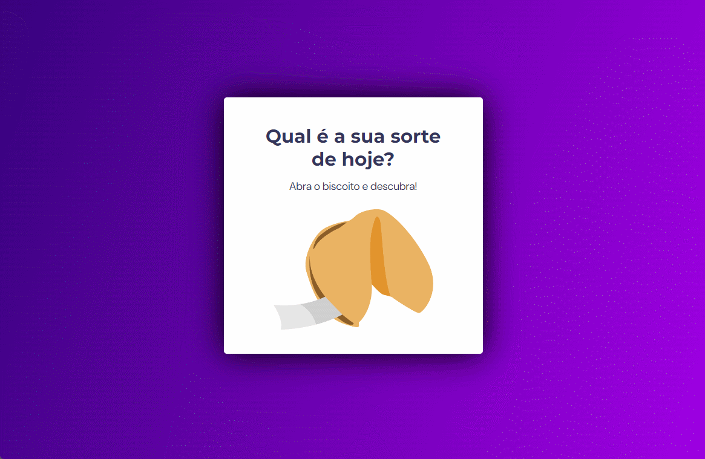

 
  

## Biscoito da sorte 
- O Biscoito da Sorte é um aplicativo web divertido que simula a experiência de abrir um biscoito da sorte virtual. Clique ou pressione “Enter” para revelar mensagens inspiradoras, provérbios e conselhos. Acesse o projeto aqui e divirta-se! 🌟

## Sobre o Projeto
 -O que é o Biscoito da Sorte?
 O Biscoito da Sorte é um aplicativo web que traz um pouco de magia para o seu cotidiano.
 Com um clique, você revela uma mensagem especial que pode variar entre provérbios, conselhos ou até mesmo previsões divertidas.

## Tecnologias 
- Estrutura de dados HTML: Explore como o conteúdo é organizado na página.

- Animações com CSS: Veja como os elementos ganham vida com transições e efeitos visuais.

- Funções em JavaScript: Descubra como o código por trás do biscoito é implementado.

- Manipulação da DOM: Aprenda a interagir com os elementos da página.
 Biblioteca JS Math: Utilize funções matemáticas para gerar números aleatórios.

- Layout da aplicação: Veja como o design foi pensado para proporcionar uma experiência agradável.

## Contribua!
- Encontrou uma mensagem inspiradora? Compartilhe no projeto!
- Sinta-se à vontade para adicionar novas funcionalidades ou melhorias.

Link do deploy do projeto: https://biscoito-da-sorte-blue.vercel.app 
